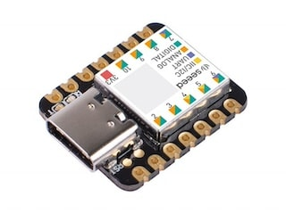
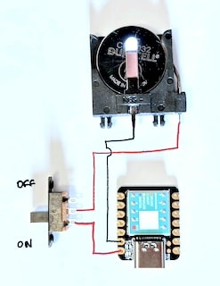
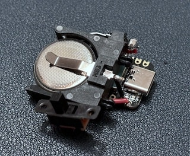

# sam-fusee-launcher-xiao
Fusee Launcher for the Seeed Studio XIAO SAMD21 board. Based on [sam fusee launcher](https://github.com/atlas44/sam-fusee-launcher).

Build and tested with Arduino SDK.

# Build
Go through [Download Arduino and install Arduino driver](https://wiki.seeedstudio.com/Download-Arduino-and-install-Arduino_Driver/) and [How to Add Seeed boards to Arduino IDE](https://wiki.seeedstudio.com/Seeed_Arduino_Boards/)

Summary:
* Download and install arduino IDE http://www.arduino.cc/en/Main/Software
* In Arduino: go to "Prefences" and add to "Additional Board Manager URLs" following URL:
*  `https://files.seeedstudio.com/arduino/package_seeeduino_boards_index.json`
* Go to "Tools > Board > Board Manager" and select Type: xiao and
* Install "Seeed SAMD Boards" by Seeed Studio
* Select the Seeeduino XIAO with "Tools > Board > Seeed SAMD Boards"

Connect the board to your computer and [short the RST pins twice](https://wiki.seeedstudio.com/Seeeduino-XIAO/#enter-bootloader-mode).
Your computer should detect the board automatically.

Got to Tools > Port and select your connected board.

Download this Repository, open main/main.ino with Arduino IDE.

Then Verify/Compile (Ctrl + R)
If no errors appear
Upload (Ctrl + U).

The board is ready for use.

LED is:
* 🟠 Steady orange - Failed to initialize USB on SAMD, check battery
* 🟠 Quick, steady orange blinking - Ready to send, searching for Switch. Insert RCM jig, Hold VOL + and Press Power
* 🔵 Short/Long (Ta Daa!) blue blink - Payload sent and activated.

# Update the Payload
Download your favorite [payload](https://github.com/CTCaer/hekate/releases) as a `.bin` file.
Run the python script `tools/binConverter.py` with the path to the file as an argument:
`python binConverter.py "C:\pathToMyPayload\hekateNew.bin` or just drag the .bin file on the script

in the same folder as the .bin file is located, a new .h file should appear. Copy the new file to the main folder and in the main.ino go to line 6 `#include "hekate_ctcaer_6.0.7.h"` and rename it to your new file `#include "hekateNew.h"`

Then just compile and upload.

# Hardware
[XIAO SAMD21 - Cortex M0+](https://www.seeedstudio.com/Seeeduino-XIAO-Arduino-Microcontroller-SAMD21-Cortex-M0+-p-4426.html)

# Thanks to:
* [atlas44](https://github.com/atlas44/sam-fusee-launcher)
* [CTCaer](https://github.com/CTCaer/hekate)
* [Ninoh-FOX](https://www.elotrolado.net/hilo_tutorial-crea-tu-propio-dongle-portatil-para-cargar-payloads-it-is-easy_2287822)
* [noemu](https://github.com/noemu/sam-fusee-launcher)
* [electronrancher](https://github.com/electronrancher/sam-fusee-launcher)
* and everyone else i forgot
